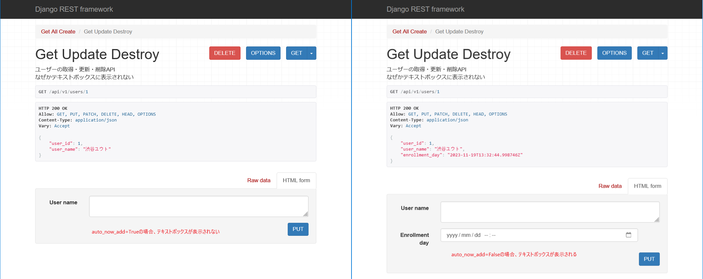
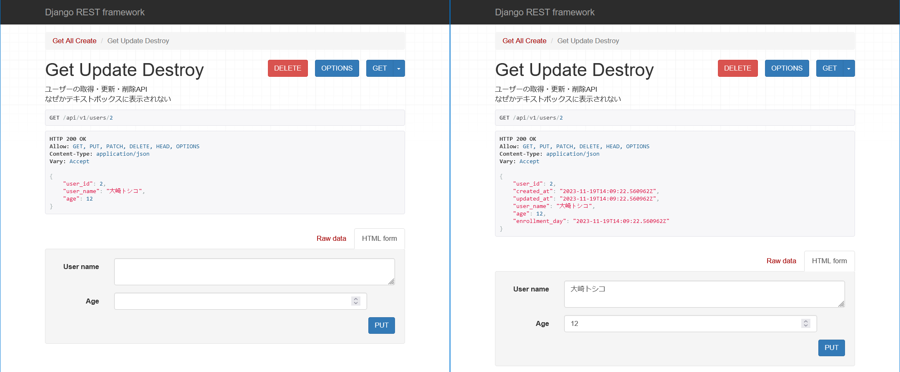

# Browsable APIのUI

Browsable API Rendererは

## auto_now_addフィールドは作られない



`auto_now_add`フラグがレコードが追加されるときのみ機能して値が付与される。  
つまり、基本的には変更を許容しないカラムである。  
そのため、Browsable APIのUIではテキストボックスが表示されない

## 通常のjsonだとすべてテキストフィールドになる



どうやら、Browsable API Rendererに値を返した際に入力フィールドに値を格納するには`<class 'rest_framework.utils.serializer_helpers.ReturnDict'>`を返す必要がある。  
この型は`serializer`の`data`プロパティが返してくれる。

### bad case

よくある実装として、`django.db.model`を返す方法がある。  
これを`model_to_dict`を使って辞書データに変換して返すことでjson形式にすることがある。
この方法では、特定の情報しか取れない。

`model_to_dict`はeditableなフィールドしか返さない仕様である。  

> `AutoField`は取れるクセに、`DateTimeField(auto_now_add=True)`が取れないのなんで？？？？？？
> 自動入力フィールドすべてが取れないならまだしもさぁ。。。

```python
class UserRepository(BaseRepository):
    def get(self,  user_id) -> User:
        # django.db.model型を返す場合
        return self.entity.__class__.objects.get(user_id=user_id)
```

### good case

いったん、取得したデータを`serializer`に食わせる方法。  
`serializer`には、`instance`と`data`の引数があるが、`instance`に渡さないと`data`を参照できないことに注意が必要である。  
この`serializer`の使い方は別で解説する。

```python
class UserRepository(BaseRepository):
    def get(self,  user_id) -> User:
        data = self.entity.__class__.objects.get(user_id=user_id)
        serializer = UserSerializer(data)
        return serializer.data
```
