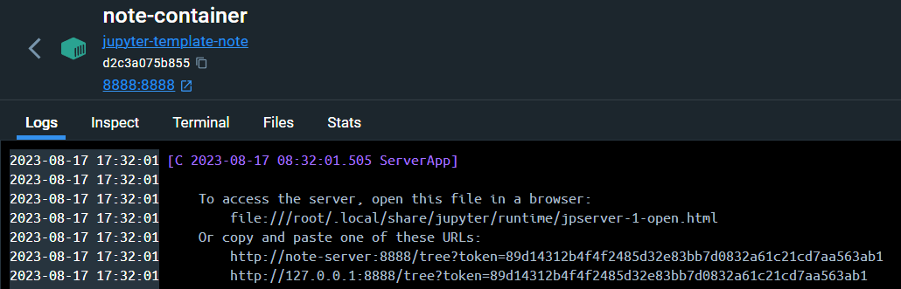

# jupyter-notebook template

Pythonをjupyter-notebookで開発する際のテンプレートプロジェクト

## ビルド方法

```console
$ docker compose --build
```

## 実行方法

```console
$ docker compose up -d
```

## jupyter-serverへのアクセス

### DockerDesktopからアクセスする

`Port(s)`の8888:8888からアクセスする。  


ただし、トークンが付与されていないのでログインページに飛ばされる。


### DockerDesktopからURLを取得する

jupyter-notebookを立ち上げた際にはトークン付きのURLが取得できる。


